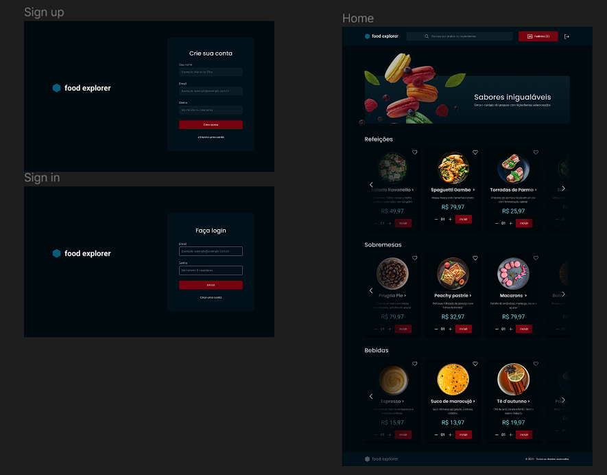

# Food Explorer - Final project - Front-end 🥘🎨

## Under development ⏳

> Aplicação que simula um cardápio de um restaurante, onde duas personas podem acessar.

> A primeira é o admin, a pessoa responsável pelo restaurante, logo, poderá criar, visualizar, editar e apagar um prato a qualquer momento.

> A segunda é o cliente, que poderá criar um registro no restaurante, visualizar todos os pratos cadastrados e, quando clicar em um prato, será redirecionado para uma nova tela com informações mais detalhadas sobre ele e adicionar ao pedido.