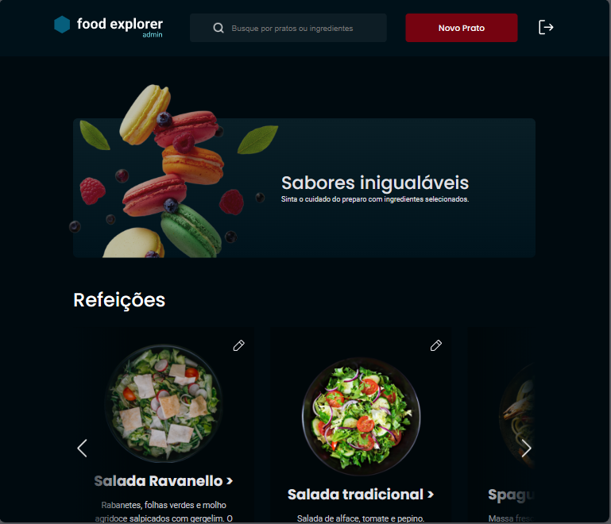
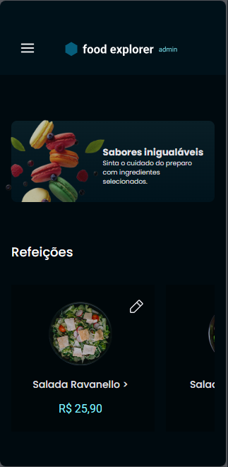

# Food Explorer - Front-end 🥗

<p align="center" style='padding-top: 20px'>
  <a href="#about">About the project 📁</a>&nbsp;&nbsp;&nbsp;|&nbsp;&nbsp;&nbsp;
  <a href="#features">Features ⚙</a>&nbsp;&nbsp;&nbsp;|&nbsp;&nbsp;&nbsp;
  <a href="#technologies">Technologies 🛠</a>&nbsp;&nbsp;&nbsp;|&nbsp;&nbsp;&nbsp;
  <a href="#usage">Utilização 💡</a>&nbsp;&nbsp;&nbsp;|&nbsp;&nbsp;&nbsp;
  <a href="#users">Personas 👥</a>&nbsp;&nbsp;&nbsp;|&nbsp;&nbsp;&nbsp;
  <a href="#license">Licença 📃</a>
</p>

<div style='display: flex; justify-content: center; gap: 100px; padding: 20px 0px;'>


</div>

<h2 id='about'>Sobre o projeto/ About the project 📁</h2>

<div style='display: flex; align-items: center; gap: 10px' >

PT-BR:
</div>
Aplicação que simula um cardápio de um restaurante, onde duas personas podem acessar, um admin e um cliente.

Este reposiório é referente ao front-end do projeto, o back-end pode ser acessado no seguinte repositório: [🔗 Back-end repository](https://github.com/tkoch97/food-explorer-api)

⚠️ **Atenção**: A API está hospedada em um serviço gratuito, por conta disso a aplicação pode demorar a receber as respostas do servidor. Ocasionando atrasos.

<div style='display: flex; align-items: center; gap: 10px' >

EN:
</div>
Application that simulates a restaurant menu, where two personas can access, an admin and a client.

This repository refers to the front-end of the project, the back-end can be accessed in the following repository: [🔗 Back-end repository](https://github.com/tkoch97/food-explorer-api)

⚠️ **Attention**: The API is hosted on a free service, therefore the application may take some time to receive responses from the server, resulting in delays.

<h2 id='features'>Funcionalidades/ Features ⚙</h2>

A aplicação contém as seguintes funcionalidades/
Functions of this application:

- SignUp
- SignIn
- SignOut
- Cadastrar pratos/ Register new dish
- Mostrar pratos cadastrados/ Show registered dishes
- Buscar pratos por nome ou ingredientes/ Search dishes by name or ingredients
- Mostrar detalhes do prato/ Show dish details
- Editar prato/ Edit dish
- Excluir prato/ Delete dish

<h2 id='technologies'>Tecnologias/ Technologies 🛠</h2>

Tecnologias que compõem essa aplicação/
Technologies of this application:

- Axios
- ReactJS
- ReactDOM
- React Icons
- React Responsive
- React Router Dom
- Styled Components
- ViteJS

<h2 id='usage' >Como usar/ How to use 💡</h2>

<div style='display: flex; align-items: center; gap: 10px' >

PT-BR:
</div>

A aplicação está disponível para uso [aqui](https://food-explorer-front-eosin.vercel.app/). Você também pode executá-la em sua máquina localmente. Certifique-se de ter o ``Node.js`` e o ``npm`` instalados antes de prosseguir com as etapas abaixo:

<div style='display: flex; align-items: center; gap: 10px' >

EN:
</div>

The application is avaiable to use [here](https://food-explorer-front-eosin.vercel.app/). You can also run it on your local machine. Make sure you have ``Node.js`` and ``npm`` installed before proceeding with the steps below


1. Clone o projeto/ clone the project:

```
$ git clone https://github.com/tkoch97/food-explorer-front.git
```

2. Acesse a pasta do projeto/ access the project's folder:

```
$ cd food-explorer-front
```

3. Instale as dependências/ Install dependencies:

```
$ npm install
```

4. Inicie o servidor/ Init server:

```
$ npm run dev
```


⚠️ **Atenção**: A API só responde aos seguintes endereços do lado do cliente/ The API only responds to the following client-side addresses: 
```
"https://food-explorer-front-eosin.vercel.app"
"http://127.0.0.1:5173"
"http://localhost:5173"
```
 ⚠️ Este projeto utiliza uma hospedagem gratuita para o back-end, portanto, pode haver atrasos no tempo de resposta do servidor./ The API is hosted on a free service, therefore the application may take some time to receive responses from the server, resulting in delays.

<h2 id="users">Personas 👥</h2>

<div style='display: flex; align-items: center; gap: 10px' >

PT-BR:
</div>

O Food Explorer possui duas personas principais: o admin e o cliente. Você pode criar um novo usuário ou testar a aplicação usando as seguintes informações de login:

Cliente:

- E-mail: user@email.com
- Senha: 123456

O usuário tem acesso restrito às funcionalidades da aplicação, podendo apenas visualizar o cardápio, buscar pratos e ver detalhes de pratos específicos. 
⚠️ As funções de favoritar e adicionar pratos ao carrinho não estão disponíveis no momento.

Admin:

- E-mail: admin@email.com
- Senha: 000000

O admin além de visuzalizar o cadápio, buscar por pratos e visualizar seus detalhes, também pode fazer o gerenciamento, adicionando novos pratos e editando ou excluindo os existentes.

##

<div style='display: flex; align-items: center; gap: 10px' >

EN:
</div>

The Food Explorer has two main personas: the admin and the customer. You can create a new user or test the application using the following login information:

Customer:

- Email: user@email.com
- Password: 123456

The user has restricted access to the application's functionalities, being able only to view the menu, search for dishes, and see details of specific dishes.
⚠️ The functions of favoriting and adding dishes to the cart are not available at the moment.

Admin:

- Email: admin@email.com
- Password: 000000

In addition to viewing the menu, searching for dishes, and viewing their details, the admin can also perform management tasks, such as adding new dishes and editing or deleting existing ones.

<h2 id="license">📝 Licença</h2>

Este projeto está sob a licença MIT./ This project is licensed by MIT.
<p>
  
</p>